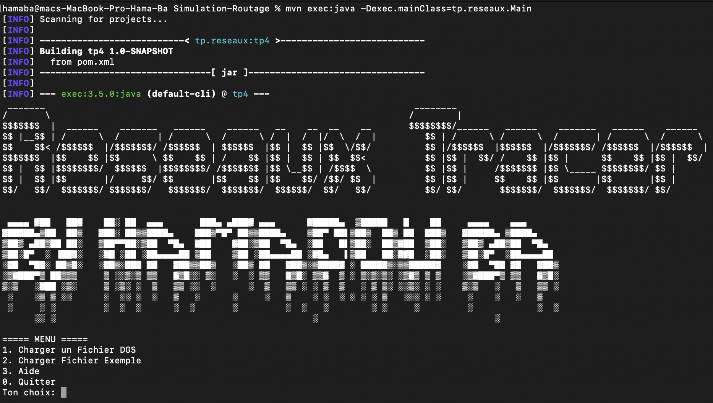
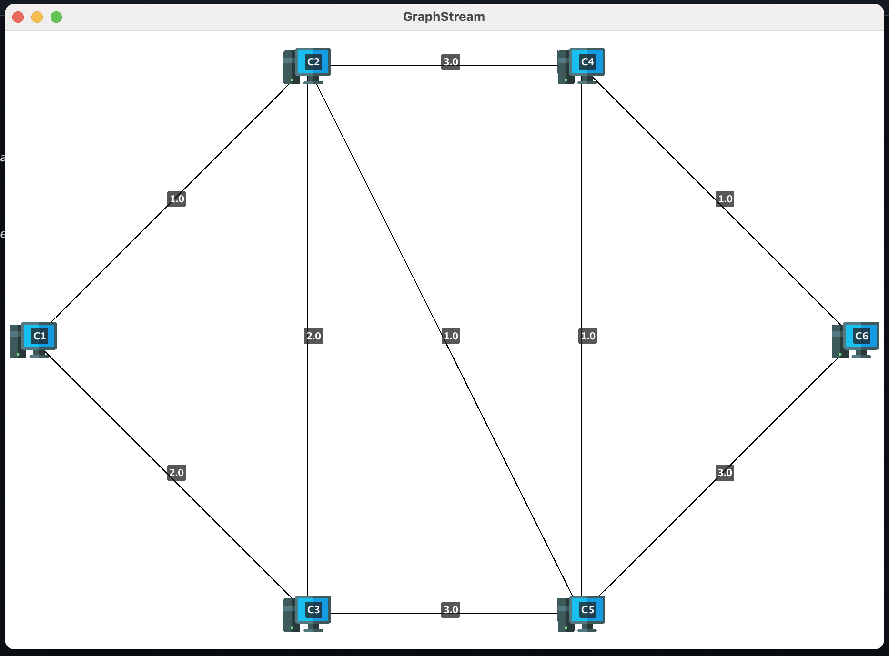
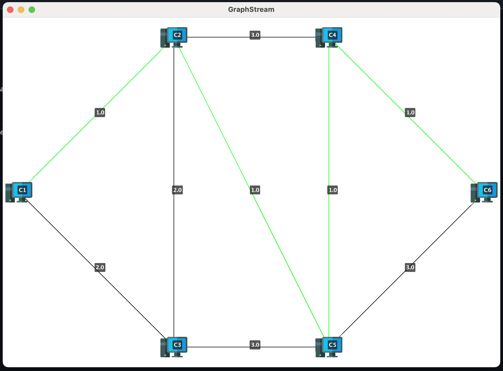

# 🌐 Reseaux Tracer : Simulation de Routage de Réseau
> Par Hamadou BA ([GitHub](https://github.com/Hama2017))

## 🚀 À propos du projet

Ce projet est une simulation complète de routage de réseau développée en Java. Il permet de modéliser, visualiser et analyser des réseaux informatiques avec différentes topologies. Vous allez pouvoir charger des fichiers de description de réseau, explorer les chemins de routage et générer des tables de routage complètes. Tout ça avec une interface simple mais efficace!



## ✨ Fonctionnalités

- 📊 **Visualisation de réseaux** - Affichage graphique des ordinateurs et leurs connexions
- 🛣️ **Calcul de chemins** - Détermination du chemin le plus court entre deux ordinateurs
- 📝 **Tables de routage** - Génération automatique des tables de routage pour chaque nœud
- 🔄 **Chargement de fichiers DGS** - Support pour les topologies personnalisées
- 🖱️ **Interface interactive** - Navigation simple dans l'application

## 🛠️ Technologies utilisées

- **Java** - Langage de programmation principal
- **Maven** - Gestion des dépendances et construction du projet
- **[GraphStream](https://graphstream-project.org/)** - Bibliothèque pour la visualisation et l'analyse des graphes
  > GraphStream m'a vraiment facilité la vie avec sa gestion intuitive des graphes et son moteur de rendu puissant!

## 📋 Prérequis

- Java JDK 17 ou plus récent
- Maven 3.6+ (pour la compilation)
- Un peu de curiosité pour les réseaux 😉

## 🚀 Installation et exécution

```bash
# Cloner le dépôt
git clone https://github.com/Hama2017/Simulation-Routage.git

# Se déplacer dans le répertoire du projet
cd reseaux-tp-4-routage

# Compiler le projet avec Maven
mvn clean package

# Exécuter l'application
java -jar target/tp4-1.0-SNAPSHOT.jar
```

## 📸 Exemples d'utilisation

### Visualisation d'un réseau

*Capture d'écran de la visualisation d'un réseau simple avec 6 ordinateurs connectés.*

### Détermination du plus court chemin

*Le chemin le plus court entre C1 et C6 est affiché en vert.*

### Table de routage générée
```
Table de routage du reseau:
SITE C1 : (C2,C3)
C2 : C2 C3
C3 : C3 C2
C4 : C2 C3
C5 : C2 C3
C6 : C2 C3

SITE C2 : (C1,C3,C5,C4)
C1 : C1 C3 C5 C4
C3 : C3 C1 C5 C4
C4 : C5 C4 C3 C1
C5 : C5 C4 C3 C1
C6 : C5 C4 C3 C1

SITE C3 : (C1,C2,C5)
C1 : C1 C2 C5
C2 : C2 C1 C5
C4 : C2 C5 C1
C5 : C2 C5 C1
C6 : C2 C5 C1

SITE C4 : (C2,C5,C6)
C1 : C5 C2 C6
C2 : C5 C2 C6
C3 : C5 C2 C6
C5 : C5 C2 C6
C6 : C6 C5 C2

SITE C5 : (C2,C3,C4,C6)
C1 : C2 C3 C4 C6
C2 : C2 C4 C3 C6
C3 : C2 C3 C4 C6
C4 : C4 C2 C6 C3
C6 : C4 C6 C2 C3

SITE C6 : (C4,C5)
C1 : C4 C5
C2 : C4 C5
C3 : C4 C5
C4 : C4 C5
C5 : C4 C5
```
*Extrait d'une table de routage générée pour un réseau à 6 ordinateurs.*

## 📊 Format du fichier DGS

Les fichiers DGS décrivent la topologie du réseau et suivent cette structure:

```
DGS004
nom_reseau 0 0
an NOM_ORDI1 xy: x,y
an NOM_ORDI2 xy: x,y
...
ae ID_CONNEXION ORDI1 ORDI2 weight:POIDS
...
```

- `an` (add node) définit un ordinateur avec ses coordonnées
- `ae` (add edge) définit une connexion entre deux ordinateurs avec un poids

## 🧩 Architecture du projet

Le projet est construit autour de ces composants principaux:

- `Ordinateur` - Représente un nœud dans le réseau
- `Connection` - Modélise un lien entre deux ordinateurs
- `Reseaux` - Gère l'ensemble du graphe et les algorithmes
- `DGSReseauxParseur` - Analyse les fichiers de topologie
- `Main` - Point d'entrée avec interface utilisateur

## 🤝 Contribution

Les contributions sont les bienvenues! N'hésitez pas à:

1. Fork le projet
2. Créer une branche (`git checkout -b feature/amelioration`)
3. Commit vos changements (`git commit -m 'Ajout: nouvelle fonctionnalité'`)
4. Push sur la branche (`git push origin feature/amelioration`)
5. Ouvrir une Pull Request

## 📄 Licence

Ce projet est sous licence libre - voir le fichier [LICENSE](LICENSE) pour plus de détails.

## 📞 Contact

Hamadou BA - [GitHub](https://github.com/Hama2017)

---

Développé avec ❤️ et beaucoup de ☕ par Hamadou BA
